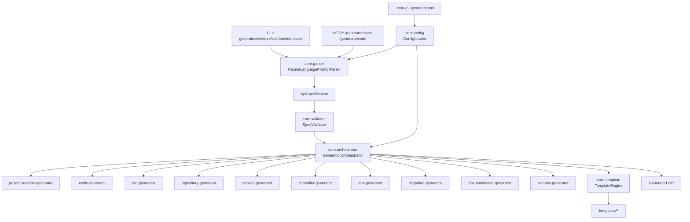

# REST API Generator Enterprise Blueprint

## 1) Updated Architecture Diagram

## 2) Complete Configuration Schema

- Machine-readable schema: `schemas/rest-api-generator-config.schema.json`
- Runtime model: `src/main/java/io/restapigen/core/config/GenerationConfig.java`

## 3) Enhanced Specification Format

- Machine-readable schema: `schemas/api-specification.schema.json`
- Runtime model: `ApiSpecification -> EntityDefinition -> EntitySpec/ApiSpec/RelationshipSpec`
- Supports field metadata (`min/max/format/encrypted/enum/default/calculated`) and relationships (`OneToMany`, `ManyToOne`, `ManyToMany`).

## 4) Template System Design

- Template packs live under `src/main/resources/templates/<pack>/`.
- Pack descriptors live under `templates/packs/*.yml`.
- Runtime uses `TemplateEngine` + `TemplatePack` via `PluginContext`.
- Inheritance strategy: pack descriptors can reference a base pack in `includes` (e.g., `spring-boot-3-standard`), then plugins may override template files by pack name.

## 5) Parser Enhancement Plan (Natural Language -> Spec)

Implemented now:
- Multi-entity splitting by blank-line segments.
- Relationship extraction:
  - `belongs to X` -> `ManyToOne`
  - `has many X` -> `OneToMany`
  - `has many X (many-to-many)` -> `ManyToMany`
- Field attribute extraction: `min`, `max`, `format`, `encrypted`, `enum`, `default`, `calculated`.
- Validation token synthesis: `NotBlank`, `Email`, `Size`, `Min`, `Max`.

Next parser increments:
1. Explicit endpoint DSL (`include login, logout, register`).
2. Relationship back-reference inference (`mappedBy` generation hints).
3. Advanced expressions for calculated fields with AST validation.
4. Security phrase parsing (`JWT authentication`) into global settings.

## 6) Plugin Architecture (Interfaces and Contracts)

- Main contract: `src/main/java/io/restapigen/core/plugin/GeneratorPlugin.java`.
- Context contract: `src/main/java/io/restapigen/core/plugin/PluginContext.java`.
- File contract: `src/main/java/io/restapigen/core/plugin/GeneratedFile.java`.
- Orchestration:
  - Topological dependency sorting.
  - Missing dependency detection.
  - Dependency cycle detection.

## 7) Five Complete Code Templates

Template files:
- `src/main/resources/templates/spring-boot-3-standard/entity.java.tpl`
- `src/main/resources/templates/spring-boot-3-standard/dto.java.tpl`
- `src/main/resources/templates/spring-boot-3-standard/controller.java.tpl`
- `src/main/resources/templates/spring-boot-3-standard/service.java.tpl`
- `src/main/resources/templates/spring-boot-3-standard/test.java.tpl`

## 8) CLI Command Reference

Primary commands:
- `generate --prompt "Create API for User with email"`
- `generate --file ./prompt.txt --pretty`
- `serve --port 8080`
- `init --config .rest-api-generator.yml --template spring-boot-3-standard`
- `validate --config .rest-api-generator.yml`
- `templates list`

Legacy-compatible flags still supported:
- `--serve`
- `--init-config`
- `--validate-config`
- `--user-request`
- `--input`

## 9) Migration Path

1. Keep existing prompt flow and HTTP endpoints (`/generator/spec`, `/generator/code`).
2. Add `.rest-api-generator.yml` via `init` command.
3. Enable/disable plugins with config lists.
4. Move generation customizations to template packs.
5. Introduce custom plugins after baseline templates are stable.

## 10) Marketing One-Pager

Headline:
- Your Team's REST API Standards, Automated

Core value:
- Deterministic generation from natural language + team config.
- Repeatable architecture layers and naming rules.
- Faster onboarding with production-like scaffolds.

Positioning:
- vs Spring Initializr: full entity + layer generation, not just starter dependencies.
- vs JHipster: API-focused and lighter operational footprint.
- vs AI assistant prompts: repeatable standards, no prompt drift.

Target teams:
- Platform teams, consulting teams, backend squads, tech leads standardizing service skeletons.
