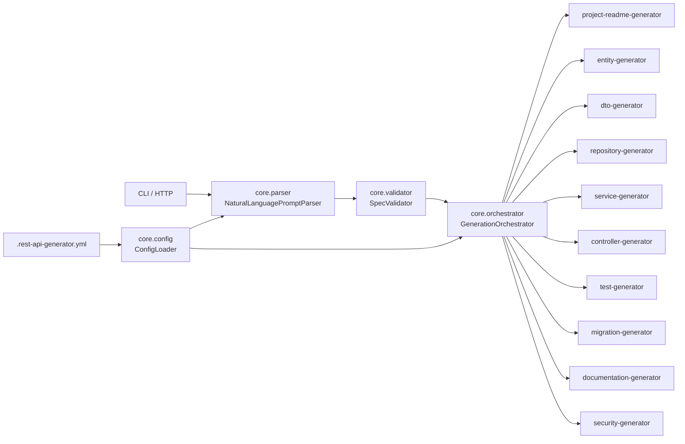

# Phase 1 Implementation: Enterprise REST API Generator Foundation

## 1. Architecture Diagram

## 2. Configuration Schema

Main config file: `.rest-api-generator.yml`.

Top-level sections:
- `project`: name/base package/Spring Boot version/Java version
- `standards`: naming, layering, database, validation, docs, testing, security, error handling, response format
- `features`: auditing, softDelete, versioning, caching
- `plugins`: enabled/disabled plugin lists

The runtime implementation is backed by `GenerationConfig` in `src/main/java/io/restapigen/core/config/GenerationConfig.java`.

## 3. Enhanced Specification Format

Current runtime format (Phase 1):
- `projectName`
- `basePackage`
- `entities[]`
  - `entity` (name, table, idType, fields)
  - `api` (resourcePath, crud, pagination, sorting)
  - `relationships[]` (type, target, fieldName)
- `suggestions[]`

Relationship support now includes:
- `belongs to X` -> `ManyToOne`
- `has many X` -> `OneToMany`
- `has many X (many-to-many)` -> `ManyToMany`

## 4. Template System Design

Phase 1 uses plugin-backed Java string templates. Each plugin owns its output templates and receives:
- parsed `ApiSpecification`
- validated `GenerationConfig`
- derived package path from `PluginContext`

Generated output is assembled through `GenerationOrchestrator` and zipped.

## 5. Parser Enhancement Plan

Implemented in `NaturalLanguageSpecGenerator` + `RequestParsing`:
- segment splitting for multi-entity prompts
- field extraction and type inference
- validation token extraction (`NotBlank`, `Email`, `Size:min:max`)
- relationship parsing (`belongs to`, `has many`, `many-to-many`)
- fallback entity suggestions when entity name is missing

## 6. Plugin Architecture

Plugin contract: `src/main/java/io/restapigen/core/plugin/GeneratorPlugin.java`
- `getName()`
- `getVersion()`
- `getDependencies()`
- `initialize(PluginContext)`
- `validate(ApiSpecification)`
- `generate(ApiSpecification, PluginContext)`

Built-in plugin registry: `src/main/java/io/restapigen/plugins/BuiltInPlugins.java`.

## 7. Phase 1 Template Coverage

Implemented plugin templates:
- Entity generator
- DTO generator
- Repository generator
- Service generator
- Controller generator
- Test generator
- Migration generator (SQL)
- Documentation generator (`openapi.yaml`)
- Security generator placeholder
- Project README generator

## 8. CLI Command Reference (Phase 1)

Implemented command options:
- `--user-request "..."`
- `--input <path>`
- `--pretty`
- `--serve`
- `--port <number>`
- `--config <path>`
- `--init-config`
- `--validate-config`

Examples:
- `./gradlew run --args="--init-config --config .rest-api-generator.yml"`
- `./gradlew run --args="--validate-config --config .rest-api-generator.yml"`
- `./gradlew run --args="--user-request \"Create an API for Product with name, price\" --pretty"`
- `./gradlew run --args="--serve --port 8080 --config .rest-api-generator.yml"`

## 9. Migration Path (Current Project -> Phase 1)

Completed in this pass:
- moved to orchestrator + plugin pipeline
- added YAML config loading and defaults
- upgraded parser/spec with relationships
- server and CLI now pass config into parse/generation

Recommended next migration step:
- evolve string templates into packable template files under `templates/`
- add per-plugin config blocks and dependency ordering in orchestrator

## 10. Positioning Summary

This tool is now positioned as a team standards automation engine:
- deterministic generation from prompts + config
- relationship-aware entity modeling
- layer/plugin-level enable/disable controls
- repeatable ZIP output for consistent project scaffolding

